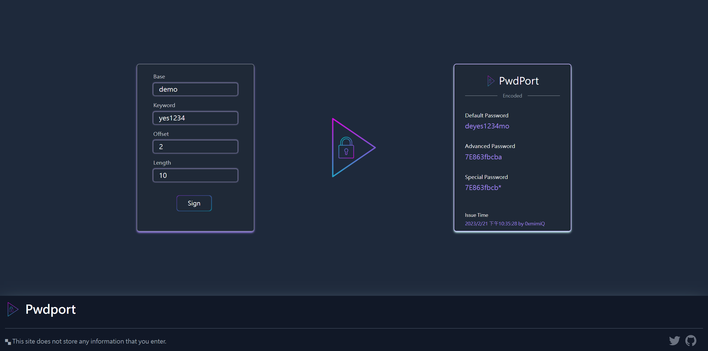

# Pwdport - 安全密碼解決方案

 &nbsp;

 

> 概述

透過這個密碼產生工具，可以幫助習慣使用相同密碼的人有更高的安全性，同時也能讓對於資安意識較強的人有更好的密碼產生工具。

### ※本服務為純前端服務，不具記憶功能、不會儲存任何您輸入的資訊。

 

## 使用方法

根據以下欄位定義輸入資訊，即可獲得一組固定的安全密碼：

- Base: 您要作為密碼基礎的一組字串，通常是您習慣的同一組密碼。
- Keyword: 您在不同 APP 或網站所使用的不同關鍵字，通常可以選擇使用網址、平台名稱、APP 名稱、網站或 APP 服務類型等等。
- Offset: keyword 插入 Base 的位置。
- Length: 您期望的密碼長度。

#### Example:

 

## 架構 & 技術

### React + Tailwindcss + Keccak256

使用者輸入的資訊將透過 Keccak256 加密雜湊混合自訂加密規則產生固定密碼。

 

## 相關參考

### - Client

- [**React**](https://reactjs.org/)
- [**Tailwindcss**](https://tailwindcss.com/docs/installation)
- [**SHA3 online tools**](https://github.com/emn178/js-sha3)
- [**ethers.js**](https://docs.ethers.org/v5/api/utils/hashing/)

 

## License

[**MIT**](./LICENSE.md)
